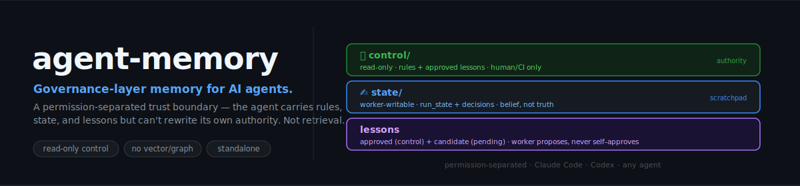

# agent-lessonbook

<p align="center">
  
</p>

<p align="center">
  <strong>English</strong> · <a href="README.zh.md">中文</a>
</p>

<p align="center">
  
  
  
  <a href="LICENSE"></a>
</p>

> **Reviewed memory for AI coding agents.** Capture user corrections, task constraints, and drift lessons during a long task — without letting the worker promote its own notes into project authority.
>
> *Reviewed corrections, constraints, and lessons the project carries forward — not tutorials, not a chat log.*

AI coding agents already have memory. The failure this targets is narrower: **mid-task, you correct the agent or clarify a requirement — and that lesson either evaporates, or silently becomes future "authority" with no review.**

- You clarify *"actually, chart titles must include the run name"* — the agent does it once, then forgets next session.
- The agent drifts, fixes the immediate bug, but never records *why* it drifted — so the next run repeats it.
- Or worse: the agent quietly rewrites a stable rule it found inconvenient, and nothing stopped it.

`agent-lessonbook` is a **project-local review queue** for those moments. The worker can record clarified constraints, corrections, and drift notes, and can *propose* lessons. It **cannot approve its own notes or rewrite project authority** — promotion is a human review step. Plain files that diff and review like code. No vector store, no graph DB, no backend.

> `agent-lessonbook` does not make agents reliably notice their own drift; it captures drift when a user, a verifier, a failing check, or a concrete self-observed error exposes it.

## Where this fits

You don't replace your existing memory — you add a review boundary on top of it.

- **Built-in agent memory** (Claude Code, Codex, Copilot): good for recall, preferences, project context.
- **Memory engines** (Mem0, Zep, Letta, LangMem): good for retrieval, graph memory, personalization, scale.
- **agent-lessonbook**: decides *which* recorded corrections and lessons are allowed to influence future behavior — review before authority.

> Most memory tools answer *"how do we store and retrieve context?"*. `agent-lessonbook` answers *"which memories are allowed to influence future agent behavior?"*

### vs your agent's built-in memory

Claude Code (auto memory, on by default) and Codex (memories) **already auto-record engineering details** — build commands, architecture notes, style. `agent-lessonbook` doesn't compete with that, and on pure recall it's weaker (capture is a skill the agent invokes, not background summarization). What it adds is what both vendors deliberately leave out: **their own docs say auto memory is a *recall layer*, not authority** — "rules that must always apply" belong in CLAUDE.md / AGENTS.md, maintained by a human. `agent-lessonbook` is the structured, git-reviewed workflow for exactly that promotion.

> Built-in auto memory helps an agent remember what it *thinks* it learned. `agent-lessonbook` is the git-reviewed gate that decides which lessons become **project authority — for every agent on the repo.**

## What it captures (and what it doesn't)

It records only **evidence-backed** things that should carry forward *and* that the worker shouldn't get to canonize on its own — five types:

1. **User corrections / acceptance prefs** — "actually, chart titles must include the run name".
2. **Drift root-causes** — *why* a wrong turn happened, so the next run avoids it.
3. **Negative constraints** — a "never do X again" learned from a mistake.
4. **Repo pitfalls proven by failure** — "running test A without env B gives false confidence".
5. **Authority-relevant architecture constraints** — "approved lessons live in `control/`; workers can't write there".

It deliberately does **not** own: how to run tests / validate the repo (→ README, Makefile, CI), project conventions and env setup (→ `CLAUDE.md` / `AGENTS.md` / lockfiles), task status and open questions (→ `run_state.yaml`, no review needed), or your personal output style (→ built-in agent memory). Keeping the journal to high-signal, review-worthy evidence is the point — a noisy "record everything" log defeats it.

## The permission model (who can write what)

```
🔒 control/   read-only to the worker (human / CI maintains)
   rules.md                 stable rules the agent must obey, cannot edit
   approved_lessons/        reviewed, promoted lessons
     index.yaml             summary-first index

✍️ state/     worker-writable, NOT a source of truth
   tasks/<task_id>/
     run_state.yaml         task checkpoint + active constraints (belief, not truth)
     correction_journal.md  clarified requirements + drift notes, as they happen
     candidate_lessons.md   proposed lessons, PENDING human review (no self-approve)
```

**Invariants:**
- The worker **cannot write `control/`** — mount it `read_only` (Claude Code subagent memory / Managed Agents memory stores enforce read_only vs read_write at the filesystem level; use that, don't build your own).
- `state/` is **working memory, not truth** (`run_state` = "what the agent believes it did").
- New lessons go to `candidate_lessons.md`; **promotion to `approved_lessons/` is a reviewed action — the worker proposes, never self-approves.** Promotion is a human git action, not something the worker can trigger.

## Skills (process, not authority)

Three skills, all worker-side process — none of them can grant authority:

- [`resume-context`](skills/resume-context/SKILL.md) — at start/resume, read `control/` rules + approved lessons + task state, and surface the **active constraints** for this run.
- [`correction-capture`](skills/correction-capture/SKILL.md) — when the user corrects/clarifies mid-task, *or* drift is exposed (by the user, a check, or a concrete self-observed error), record it to `state/.../correction_journal.md`: what was expected, what happened, likely cause, prevention.
- [`lesson-propose`](skills/lesson-propose/SKILL.md) — at wrap-up, turn the journal into *candidate* lessons for review, classified by target tier. **Proposes only; never promotes.**

Promotion (candidate → `approved_lessons/` or `rules.md`) is deliberately **not a skill** — it's a human review step in git, so the worker can never reach authority through tool use.

Capture is a skill the agent *invokes*, so it can be missed. To fire it reliably, add the host-agnostic nudge (one line in `CLAUDE.md` / `AGENTS.md`) or optional Claude Code / Codex hooks — they only *trigger* capture, never write or promote. See [`integrations/`](integrations/).

## Quick start

```bash
npx skills add zhjai/agent-lessonbook -g -a claude-code   # or -a codex, cursor, … any host
```

A normal loop on a long task:

1. **Start:** `resume-context` loads the rules + approved lessons + last task state, and lists the active constraints.
2. **Mid-task:** you say *"actually, the export must include the month column"* → `correction-capture` writes it to the journal and adds it to the run's active constraints, so it isn't forgotten three steps later.
3. **Drift exposed:** a check fails / you point out a miss → `correction-capture` records the cause + how to prevent it next time.
4. **Wrap-up:** `lesson-propose` files the keepers into `candidate_lessons.md`.
5. **You review** the candidates and promote the good ones into `control/` (a normal git commit). Only then are they authority.

It's just files — `git diff` your `state/` and `control/` like any other change. No backend to run.

## Pairs with agent-completion-gate

`agent-lessonbook` captures **process lessons during** the work. [`agent-completion-gate`](https://github.com/zhjai/agent-completion-gate) is a separate, standalone tool for **acceptance at the end** (the agent can't self-declare a task complete). They are **independent** — the gate never reads this lessonbook at runtime. The only link is human-mediated: a recurring lesson you review here may prompt *you* to add a check to the gate's protected manifest.

## Status

`v0.3.1` preview. MIT. Portable, agent-agnostic, file-based, standalone. (Renamed from `agent-memory`.)
